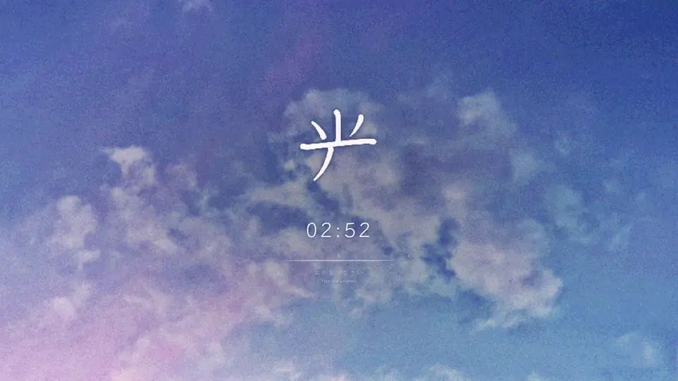
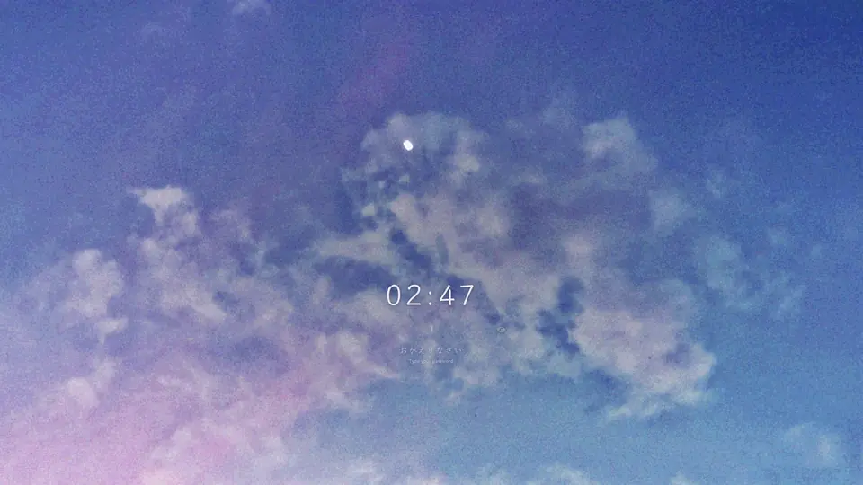
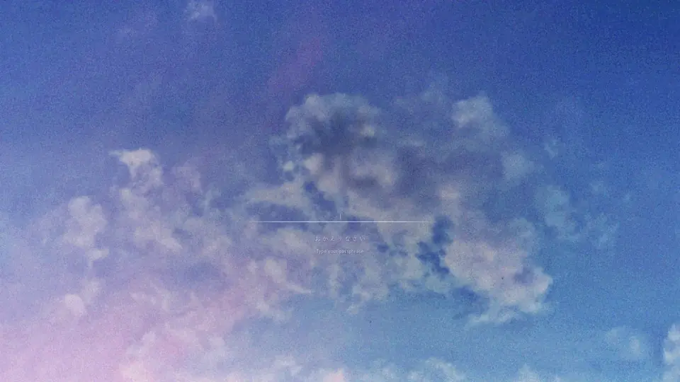

# Hikari 99 lock screens for Omarchy



Four lock screens for the [Lock Screen Explorer](https://github.com/SirJul1337/omarchy-lock-explorer),
drawn the way the Sky 99 wallpaper was made: a coarse pixel grid, 12-bit color
and a dither that sparkles cell by cell. The longer you're away, the later it
gets on the screen.

| | |
|---|---|
| **Hikari 99** 光 | Your wallpaper, alive. 光 ("light") is written stroke by stroke in textbook order. Evening comes at about 5 minutes, the first stars at 13, full night at 22 (or on your own timing). Typing lets light through the clouds and brings the day back. A wrong password is a cloud's shadow; the right one parts the clouds. |
| **Hikari 99 Real Sky** | The same, but the real sun decides: day while the sun is up where you are, evening at sunset, stars at night. |
| **Tsukiyo 99** 月夜 | "Moonlit night." The day in 12-bit color, the evening in four hatched colors, the night in 1-bit dither with 月 as an eclipse. Each key sends a ripple out. A wrong password is a VHS tracking error. |
| **Tsukiyo 99 Real Sky** | Tsukiyo 99 on the real sun. |



The previews run five times faster than life. The full 4K recordings are on the
[release page](https://github.com/hikari112/omarchy-hikari-99/releases/latest).

Optional, for the whole look (the installer asks about each):

- **Sky 99**: the theme these were made with, wallpaper included. Or just the
  wallpaper, added to your current theme.
- **Living Sky** (experimental): the desktop wallpaper animated the same way,
  all the time.
- **The boot screen**: the disk unlock when you start up, in the same sky.
- **Stay lit**: the lock screen stays on until night has come, so you see
  evening and night arrive.
- **Keyboard lighting** for the Keychron Q6 Max: the same sky on the keys,
  joining in when you lock.

## What you need

- Omarchy 4
- The [Lock Screen Explorer](https://github.com/SirJul1337/omarchy-lock-explorer) plugin. The installer offers to add it. Made with version 1.9.1.
- The fonts Klee One and Murecho. They come with this (SIL Open Font License)
  and are installed if you don't have them.
- For the boot screen: Pillow (`python-pillow`). The installer offers it.

## Install

```sh
git clone https://github.com/hikari112/omarchy-hikari-99.git
cd omarchy-hikari-99
./install.sh
```

It asks about each optional part and which lock screen to use. To skip the
questions:

```sh
./install.sh --all                          # everything, with the Sky 99 theme
./install.sh --yes                          # the four lock screens only
./install.sh --yes --theme --boot --night 45 --set my-hikari-99
./install.sh --yes --wallpaper --living-desktop --stay-lit
./install.sh --help                         # every option
```

Then open the explorer with `omarchy-shell lock explore`: they're under
Animation, or search for `hikari` or `tsukiyo`. From a terminal:

```sh
omarchy-shell lock setDesign my-hikari-99            # or my-hikari-99-real-sky, my-tsukiyo-99, my-tsukiyo-99-real-sky
omarchy-shell lock previewDesign my-tsukiyo-99       # try one (you can type in the preview)
```

If a design shows up as the plain fallback right after installing, restart the
shell once: `omarchy restart shell`.

Installed 1.0.0? Tsukiyo is called Tsukiyo 99 now. Pull and run `./install.sh`
again: it takes the old files out and moves your lock screen over if it was
Tsukiyo.

## Good to know

- **They follow your theme.** The sky is your current wallpaper and the colors
  are your theme's. They look their best with Sky 99, but work with any
  wallpaper, and sky photos especially.
- **Where the Real Sky versions get the sun.** From your timezone's reference
  city, with no network needed. For your exact spot, put
  `latitude longitude` in degrees on one line in
  `~/.config/omarchy/lock-designs/shared/location`, for example
  `40.71 -74.01`.
- **How long night takes.** Hikari 99 and Tsukiyo 99 reach night 22 minutes after
  you lock, with evening at about 5 and the first stars at about 13. The
  installer asks for your own length, from 2 minutes to a day, and everything
  keeps the same pace: at 45 minutes, evening comes at about 10 and the stars at
  about 27. Change it later with `./install.sh --yes --night 45`, or put the minutes
  in `~/.config/omarchy/lock-designs/shared/night-minutes`; the next lock uses
  it. The Real Sky versions follow the sun instead.
- **The screen goes dark after 5 seconds** with the explorer's default
  settings. The sky keeps its time while the screen is off, so waking it later
  shows evening or night. To watch it come, choose Stay lit (or
  `./install.sh --stay-lit`): the lock screen stays on for your night length
  plus 8 minutes, an hour at most (the explorer's limit).
  You can change it any time in the explorer's settings.
- **Several monitors.** Every monitor gets the whole sky (the explorer's
  default; if you pick one monitor for the password in its settings, the others
  show its companion screen). The screens share one clock, and a monitor that
  disconnects while it sleeps (many DisplayPort monitors do) comes back at the
  same time of night.
- **They play their own unlock.** The explorer holds the screen for a couple of
  seconds while the clouds part. (It does that for a design that mentions
  "ClipDesign"; if a later explorer version changes that, the unlock is
  simply instant.)
- **Reduce motion** in the explorer's settings is respected.

## The boot screen



The disk unlock at startup, in the Hikari 99 sky: 光 written stroke by stroke,
your passphrase as pencil marks on a line of light, a cloud's shadow for a wrong
one, and a flood of light when the disk opens. Without disk encryption you see
it for a moment while the computer starts.

- It is drawn for each of your monitors at their own size, from your theme and
  wallpaper, which takes about a minute. It then goes in through the explorer's
  own boot tool, which asks for your password once.
- When you change themes, the explorer draws it again with the new colors, and
  asks for your password to put it in (you can turn that off in its settings).
- New monitors? Run `./install.sh --boot` again so it is drawn for them. Until
  then a new screen shows the nearest size, scaled.
- It lives with the design in `~/.config/omarchy/lock-designs/hikari-99/boot`,
  linked into the explorer's `plymouth/` folder. If an explorer update drops
  that link, `./install.sh --boot` puts it back.
- Back to Omarchy's own: `./install.sh --uninstall`, or
  `bash ~/.config/omarchy/plugins/io.github.sirjul1337.lock-explorer/plymouth/apply.sh stock`.

## Living Sky (experimental)

Your desktop wallpaper, drawn in 12-bit dither with drifting clouds and a
breathing light, at your display's refresh rate. It replaces Omarchy's own
background plugin (switching themes still works) and pauses while a fullscreen
window covers the monitor.

It costs GPU power, because the screen is redrawn every frame: on an Arc A750
driving a 4K and a 1080p screen, the card drew about 25-30 W more with it on.
Turn it off and on without uninstalling:

```sh
omarchy-shell background living false    # the plain wallpaper
omarchy-shell background living true
```

Run `omarchy restart shell` once after installing so those commands reach it.
Remove it with `omarchy plugin disable io.github.hikari112.living-sky`, or
with `./install.sh --uninstall`.

## Keyboard lighting (Keychron Q6 Max)

The board becomes a window onto the same sky. Its colors come from the Sky 99
wallpaper: lilac in the lower left, periwinkle across, deeper blue toward the
upper right. Soft clouds drift over it the way the desktop's do, and the lilac
corner breathes in time with the desktop. When you lock, it follows the screen:
a slow breath, deeper as evening comes, a key here and there twinkling at night.
Each key you type sends light across the board (never which key), a wrong
password passes over as a shadow, and the unlock spreads light out with the
screen.

- **Only the Q6 Max, ANSI with knob, on its cable.** The light map is made for
  that board, on the firmware from Keychron Launcher (1.1.1). With any other
  keyboard it does nothing. The installer only asks when that board is plugged
  in; `./install.sh --keyboard` installs it anyway.
- **It takes over the lighting.** It runs the board at full brightness and puts
  the knob back if you turn it. Changes made in Keychron Launcher are drawn over
  while it runs. Stop it with `systemctl --user disable --now keychron-glow.service`
  (the board keeps its last colors until you pick another effect).
- **It needs to reach the keyboard.** If no udev rule gives you access, the
  installer adds one (`/etc/udev/rules.d/70-keychron-hidraw.rules`, asks for your
  password). Keychron Launcher and VIA use the same access.
- **Settings** are at the top of `~/.local/share/omarchy-hikari-99/keychron-glow.py`:
  `SCENE = "gradient"` for a gradient that follows your theme instead, and
  `DEAD_BLUE` to hold a key with a failed LED at one color. Restart it after
  editing: `systemctl --user restart keychron-glow.service`.

Other keyboards can join in too: see the socket under For tinkerers.

## Uninstall

```sh
./install.sh --uninstall
```

This takes out the lock screens, the wallpaper, Living Sky, the boot screen
(Omarchy's own comes back; asks for your password) and the keyboard lighting,
puts your lock screen back to the explorer's default and the screen blanking
back to what it was. It asks before removing the theme and the udev rule, and
leaves the fonts in `~/.local/share/fonts/omarchy-hikari-99`.

## For tinkerers

- Each design's sky is a shader: `lock-designs/hikari-99/sky.frag` and
  `lock-designs/tsukiyo-99/sky.frag`. After editing one, run the `build.sh` next to
  it (needs `qt6-shadertools`). It compiles the shader and regenerates the Real
  Sky twin, so edit `Hikari-99.qml` or `Tsukiyo-99.qml` and never the twins.
- After editing a design, run `omarchy-shell lock reloadDesigns` so open
  previews pick up the change.
- The boot screen is drawn by `lock-designs/hikari-99/boot/render.py` (Pillow)
  and scripted by `script_multi.py`. `generate.sh <folder>` draws a copy into
  a folder without installing anything; `HIKARI_BOOT_SIZES=2560x1440,1920x1080`
  picks the sizes by hand.
- Keyboard lighting: if something listens on
  `$XDG_RUNTIME_DIR/keychron-glow.sock`, the lock screens tell it what happens,
  one line each: `lock <breath phase> <breath period>`, `ping <breath phase>
  <dusk>`, `wake`, `sleep`, `key`, `back`, `fail`, `unlock`. Never which key.
  With nothing listening, they don't try. `optional/keyboard/keychron-glow.py`
  is one listener; write your own for another keyboard or anything with a light.

## Credits

Art, lock screens, boot screen and theme by hikari. Stroke order from
[KanjiVG](https://kanjivg.tagaini.net/) (CC BY-SA 3.0). Fonts Klee One and
Murecho (SIL OFL). Built for SirJul1337's Lock Screen Explorer; Living Sky is
based on Omarchy's background plugin. Code MIT, art CC BY 4.0. Details in
[NOTICE.md](NOTICE.md).
